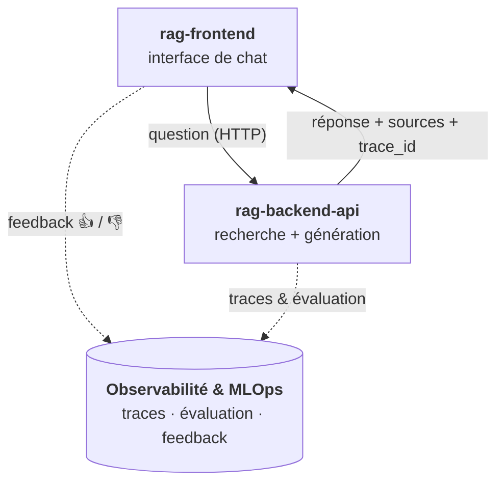

# RAG — Assistant conversationnel fiable, fondé sur vos documents

Un assistant qui répond aux questions posées en langage naturel (et dans plusieurs langues) **uniquement à partir d'un corpus de documents** : chaque réponse s'appuie sur des sources vérifiables, et lorsque l'information est absente, l'assistant le dit plutôt que d'inventer.

Le projet couvre toute la chaîne d'une application RAG (*Retrieval-Augmented Generation*) : un moteur de recherche et de génération exposé via une API, une interface de chat pour l'essayer, et une boucle de mesure et d'amélioration de la qualité des réponses.

## Fonctionnalités globales

- **Recherche par le sens, pas par mots-clés** : une question reformulée, ou posée dans une autre langue, retrouve les bons passages du corpus.
- **Réponses fondées sur les sources** : le LLM ne répond qu'à partir des extraits retrouvés, sans supposition, et reconnaît quand la réponse n'est pas dans les documents.
- **Transparence** : chaque réponse est accompagnée des passages utilisés (titre, auteur, score de pertinence).
- **Résultats variés et pertinents** : les passages redondants ou hors sujet sont écartés avant la génération.
- **Réglages en direct** : le niveau d'exigence de la recherche peut être ajusté à chaque question pour expérimenter.
- **Retour utilisateur** : chaque réponse peut être notée (👍 / 👎, avec commentaire) pour alimenter l'amélioration continue.
- **Qualité mesurée en continu** : les échanges sont tracés et les réponses évaluées automatiquement.

## Backend

### `rag-backend-api` — le moteur RAG

API REST qui constitue le cœur du système. À chaque question, elle :

1. recherche les passages les plus proches sémantiquement dans une base vectorielle ;
2. écarte les résultats trop éloignés ou redondants ;
3. demande à un LLM de formuler une réponse en s'appuyant strictement sur ces passages ;
4. renvoie la réponse, ses sources et un identifiant de trace pour rattacher un éventuel feedback.

Elle est construite en **architecture hexagonale** : le LLM, la base vectorielle, les embeddings, l'observabilité et l'évaluation sont des composants interchangeables, sans impact sur la logique métier. Elle est testée (tests unitaires et de contrat), conteneurisée et déployée sur Hugging Face Spaces.

## Frontend

### `rag-frontend` — l'interface de chat

Application web de type chat qui interroge l'API déployée. L'utilisateur pose sa question et obtient la réponse avec les sources et leurs scores. Elle permet de :

- ajuster les paramètres de recherche à la volée (nombre de passages, diversité, seuil de similarité) ;
- noter chaque réponse et laisser un commentaire ;
- visualiser immédiatement l'effet de chaque réglage sur les sources et sur la réponse.

C'est à la fois une démonstration du produit et un outil de recueil de retours pour améliorer le système. Elle est déployée séparément, sur son propre Space Hugging Face.

## Qualité / MLOps

Un assistant basé sur un LLM invente facilement des réponses : la qualité doit donc être **observée, mesurée et améliorée en continu**.

1. **Observer** : chaque échange est tracé (latence, consommation de tokens, coût estimé) et les retours utilisateurs sont rattachés à la réponse concernée (Langfuse). Sans service d'observabilité, le système bascule automatiquement sur des logs locaux.
2. **Mesurer** : après chaque réponse, une évaluation automatique calcule des métriques de qualité (Ragas) publiées avec les traces.
3. **Améliorer** : les réglages de recherche sont ajustables en direct depuis l'interface pour comparer leur effet.
4. **Déployer** : les deux composants sont conteneurisés / déployés automatiquement sur Hugging Face Spaces à chaque mise à jour, et la base vectorielle est publiée comme dataset versionné.

## Stack technique

### Backend (`rag-backend-api`)

- **Python 3.12** : langage du projet
- **FastAPI / Uvicorn** : API REST et serveur ASGI
- **Pydantic** : validation des requêtes et réponses
- **ChromaDB** : base de données vectorielle
- **Sentence-Transformers / LangChain** : embeddings multilingues (`paraphrase-multilingual-MiniLM-L12-v2`) et recherche MMR
- **Google Gemini (`google-genai`)** : génération des réponses
- **pytest** : tests unitaires et de contrat
- **Docker** : conteneurisation
- **Hugging Face Spaces / Hub** : déploiement de l'API et hébergement de la base vectorielle (dataset)

### Frontend (`rag-frontend`)

- **Python 3.12** : langage de l'application
- **Gradio** : interface de chat
- **Requests** : appels vers l'API
- **Hugging Face Spaces** : déploiement de l'interface

### Qualité / MLOps

- **Langfuse** : observabilité LLM (traces, coûts, feedback utilisateur)
- **Ragas** : évaluation automatique des réponses
- **Hugging Face Spaces** : déploiement continu à chaque mise à jour
